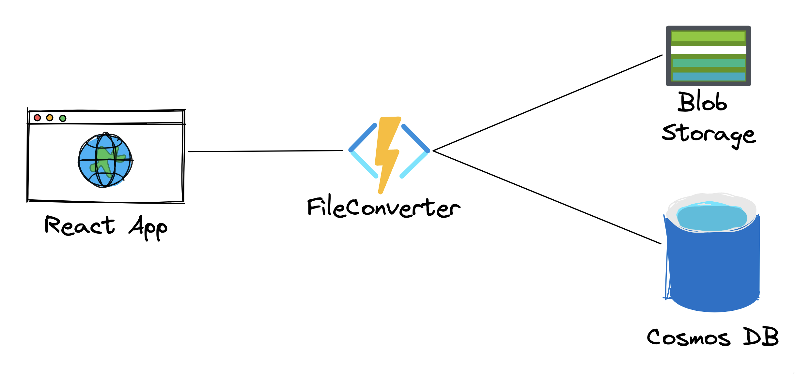

# FileFusion

Este projeto é uma aplicação web que permite aos usuários fazer upload de imagens e convertê-las para um formato diferente. O projeto usa o Azure para hospedar toda a infraestrutura, incluindo um aplicativo web frontend, uma Azure Function para converter imagens usando o Typescript e Jimp e uma pasta Terraform contendo toda a infraestrutura como código (IaC).

## Arquitetura

A arquitetura da aplicação consiste em três componentes principais:

1. Frontend Web App - O frontend é construído usando React, TypeScript e Vite. Ele fornece uma interface de usuário para fazer upload de imagens e selecionar o formato de saída desejado.
2. Azure Function - A Azure Function é um gatilho HTTP que converte imagens usando a biblioteca Jimp. É responsável por receber a imagem enviada, processá-la e retornar a imagem convertida para o usuário.
3. Terraform - A pasta Terraform contém toda a infraestrutura como código. Ele define os recursos do Azure necessários para a aplicação, incluindo a Storage Account para armazenar as imagens enviadas, o aplicativo de função para hospedar a Azure Function e os componentes de rede necessários.

## Como começar

Para começar com o projeto, siga estas etapas:

1. Clone o repositório para sua máquina local.
2. Instale o Terraform e configure suas credenciais do Azure.
3. Navegue até a pasta `terraform` e execute `terraform init` para inicializar o projeto.
4. Execute `terraform apply` para criar os recursos do Azure necessários.
5. Execute `npm install` para instalar as dependências na raiz do repositório.
6. Execute `npm start` para iniciar o aplicativo web frontend e a azure function.
7. Abra o navegador e acesse `http://localhost:5173` para acessar o aplicativo web e converter uma imagem.

## Licença

Este projeto está licenciado sob a Licença MIT. Consulte o arquivo [LICENSE](LICENSE) para obter detalhes.